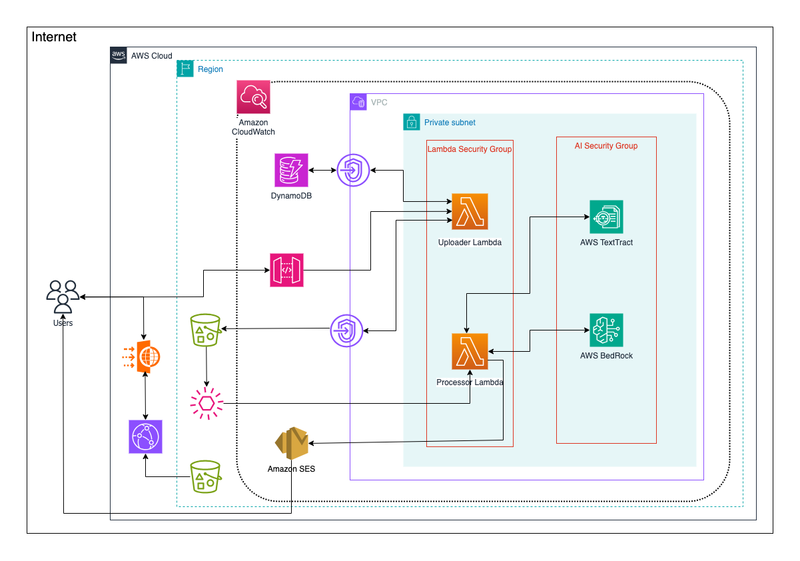
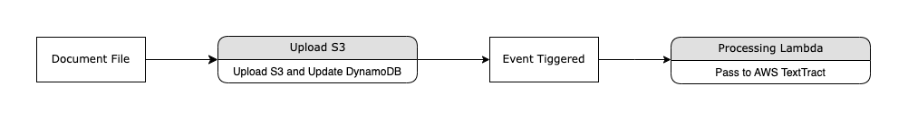
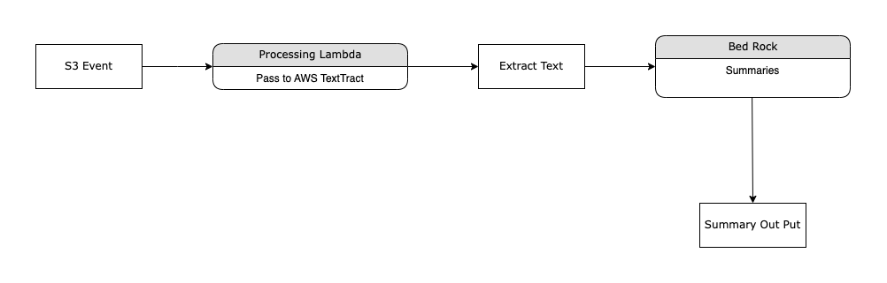

# AI Summarizer

## Overview
The **AI Summarizer** is a serverless, cloud-native application built on AWS for Intelligent Document Processing (IDP) using Generative AI. It automates the ingestion, text extraction, and summarization of documents (PDF, JPG) to deliver concise, context-aware summaries via email. This project was developed as part of the CSCI 5411: Advanced Cloud Architecting course at Dalhousie University by Basit Ali Tramboo, Master of Applied Computer Science.

The system leverages AWS services to ensure scalability, security, and cost-efficiency, with a React-based frontend and a fully managed backend. Infrastructure is defined using AWS CloudFormation for reproducibility, and a CI/CD pipeline via GitHub Actions automates frontend deployments.

## Introduction
The AI Summarizer addresses the challenge of manually reviewing large volumes of textual content (e.g., research papers, legal documents) by automating document summarization. It uses AWS serverless services for scalability and cost-efficiency, with a focus on domains like academia, legal review, and knowledge management.

Key features:
- **Frontend**: React + TypeScript SPA hosted on Amazon S3, served via CloudFront with AWS WAF for security.
- **Backend**: AWS Lambda, API Gateway, and EventBridge for event-driven processing.
- **AI Pipeline**: Amazon Textract for OCR, Amazon Bedrock (Titan) for summarization, and Amazon SES for email delivery.
- **IaC**: AWS CloudFormation for infrastructure provisioning.
- **CI/CD**: GitHub Actions for automated frontend deployment.

## Architecture Design
### High-Level Architecture


The system follows a modular, three-tier, serverless architecture:
- **Presentation Layer**: React SPA on S3 + CloudFront, protected by AWS WAF.
- **Application/API Layer**: API Gateway and Lambda for file uploads, quota checks, and summary retrieval.
- **Processing Layer**: EventBridge, Lambda, Textract, Bedrock, DynamoDB, and SES for asynchronous document processing and delivery.

#### Technology Stack
| Layer             | Technology/Service                                      |
|-------------------|-------------------------------------------------------|
| Frontend          | ReactJS + TypeScript, S3, CloudFront, WAF             |
| Backend Compute   | AWS Lambda (Node.js 22)                               |
| Storage           | Amazon S3 (uploads, Summaries)                        |
| Database          | Amazon DynamoDB (Logs, Summaries)                     |
| AI/ML Services    | Amazon Textract, Amazon Bedrock (Titan)               |
| Email Delivery    | Amazon SES                                            |
| API Management    | Amazon API Gateway                                    |
| Monitoring        | Amazon CloudWatch                                     |
| IaC               | AWS CloudFormation                                    |

### Data Flow Pipelines
#### Data Ingestion Pipeline

- **Process**: Users upload documents via the React frontend to API Gateway, which triggers the `UploadHandler` Lambda. The Lambda validates the file, checks quotas in DynamoDB, and stores the file in S3 (`uploads/` prefix).

#### Data Generation Pipeline

- **Process**: S3 events trigger the `DocumentProcessor` Lambda via EventBridge. The Lambda uses Textract for OCR (if needed), generates summaries with Bedrock Titan, stores results in DynamoDB and S3, and sends an email via SES.

## AWS Service Configuration
### Amazon S3
- **Buckets**:
  - `Uploads/`: Stores user-uploaded documents.
  - `Summaries/`: Stores generated summaries.
  - Static hosting bucket for React frontend.
- **Config**: Versioning enabled, SSE-S3 encryption, lifecycle policies to Glacier after 90 days.

### Amazon API Gateway
- **Endpoints**: `/upload`, `/summary/{jobId}`
- **Config**: CORS enabled, throttling (100 RPS, burst 200), CloudWatch logging.

### AWS Lambda
- **Functions**:
  - `UploadHandler`: Validates uploads, checks quotas, stores files (512 MB, 15s timeout).
  - `DocumentProcessor`: Processes files, extracts text, summarizes, sends emails (1024 MB, 60s timeout).
  - `QuerySummary`: Retrieves summaries (256 MB, 5s timeout).
- **Config**: Deployed in private VPC subnets, environment variables for bucket/table names.

### Amazon DynamoDB
- **Tables**:
  - `Logs`: Tracks user upload quotas.
  - `Summaries`: Stores summary metadata.
- **Config**: On-demand mode, TTL for stale records.

### Amazon Bedrock
- **Model**: Titan Text Summarize for summarization.
- **Config**: Accessed via VPC interface endpoint, retry logic in Lambda.

### Amazon Textract
- Extracts text from scanned documents (JPG, PDF).
- Used as a fallback for non-text files.

### Amazon SES
- Sends summaries and original files via email.
- Configured with a verified sender domain.

### Amazon CloudWatch
- Log groups for each Lambda, custom metrics for upload latency, alarms for errors.

### Amazon EventBridge
- Triggers `DocumentProcessor` Lambda on S3 `ObjectCreated` events.

### AWS CloudFormation
- Single template provisions entire stack (VPC, Lambda, S3, etc.).
- Parameters for bucket names, sender email, and function ARNs.

### Networking & Security
- **VPC**: Custom VPC with public (NAT Gateway) and private subnets (Lambda, endpoints).
- **VPC Endpoints**: Gateway endpoints for S3/DynamoDB, interface endpoint for Bedrock.
- **Security Groups**: Restrict Lambda to HTTPS outbound, endpoints to Lambda traffic.
- **IAM**: Least privilege roles for Lambda, scoped to specific services.

## Infrastructure as Code (IaC)
### CloudFormation Template
- **Structure**:
  - Parameters: `FilesS3BucketName`, `SourceCodeS3BucketName`, `SenderEmail`.
  - Resources: VPC, subnets, Lambda, S3, DynamoDB, API Gateway, SES, CloudWatch.
  - Outputs: Bucket name, CloudFront Distribution ID.
- **Features**:
  - Private networking with VPC endpoints.
  - Security groups for HTTPS-only traffic.
  - CI/CD integration with GitHub Actions.

### Deployment Workflow
1. Developer pushes code to GitHub.
2. GitHub Actions validates CloudFormation template (`cfn-lint`), builds React app, and deploys to S3.
3. CloudFormation deploys stack with automatic rollback on failure.
4. CloudFront cache invalidation ensures updated frontend.

## Testing and Validation
### Manual Testing
- **File Upload**: Validated PDF/JPG uploads to S3.
- **Quota Enforcement**: Confirmed 10-upload limit per email.
- **Text Extraction**: Verified Textract accuracy for clear text.
- **Summarization**: Ensured Bedrock summaries were coherent.
- **Email Delivery**: Confirmed SES emails with attachments.

### Test File Set
| File Name        | Content Type              | Expected Outcome                     |
|------------------|---------------------------|--------------------------------------|
| sample1.pdf      | Academic text             | Summary + Email delivery             |
| receipt.jpg      | Scanned image             | Textract success + Summary           |
| blurryscan.pdf   | Low-quality scan          | Partial text extracted               |
| 10uploads.pdf    | Same email, 10 uploads    | Quota exceeded message               |
| nontextimage.jpg | Chart-only image          | "No text found" message              |

### Observations
- Consistent behavior across environments due to IaC.
- Minimal delays with asynchronous processing.
- Textract limitations with blurry/handwritten content.
- SES minor delays under high load, but no failures.

## Results and Observations
- **Accuracy**: High-quality summaries for clear text; limited for blurry scans.
- **File Support**: PDF/JPG supported; Textract less effective for handwritten content.
- **Quota Enforcement**: DynamoDB accurately enforced 10-upload limit.
- **Responsiveness**: Average processing time ~17–22 seconds.
- **Monitoring**: CloudWatch alarms detected errors effectively.

## Security Architecture
- **IAM**: Least privilege roles for Lambda, scoped to specific services.
- **Encryption**: S3 SSE, DynamoDB encryption, TLS for in-transit data.
- **Network**: Private subnets, VPC endpoints for S3/DynamoDB/Bedrock.
- **Monitoring**: CloudWatch logs/alarms for Lambda, API Gateway, CloudFront.
- **Frontend**: WAF protects against SQLi/XSS, CORS restricts API access.

## Cost Analysis
| Service            | Estimated Cost                              |
|--------------------|---------------------------------------------|
| S3 (Static Hosting)| $0.023/GB + $0.09/GB transfer              |
| CloudFront         | $0.085/GB + $0.0075/10,000 requests        |
| WAF                | $5/Web ACL + $1/rule + $0.60/M requests     |
| Lambda             | $0.20/M requests (1M free)                 |
| S3 (Uploads)       | $0.023/GB/month                            |
| DynamoDB           | Free tier (200M read/write ops)            |
| Bedrock            | $0.015/1,000 tokens (Claude 3 Haiku)       |
| Textract           | $1.50/1,000 pages after 1,000 free         |
| SES                | $0.10/1,000 emails (62,000 free)           |

**Optimization**: Serverless model, free tier usage, quota limits, and lifecycle policies minimize costs.

## Limitations and Future Enhancements
### Limitations
- **Hallucination**: Bedrock may produce inaccurate summaries for unclear inputs.
- **No Real-time Feedback**: Lacks live upload status updates.
- **Fixed Quota**: Hardcoded 10-upload limit.
- **Format Support**: Limited to PDF/JPG.
- **Email-only Output**: No dashboard for past summaries.

### Future Enhancements
- Add RAG to improve summary accuracy.
- Implement a user dashboard for upload history.
- Support dynamic quotas based on user tiers.
- Expand format support (DOCX, TXT).
- Enable multi-language processing.

## Delivery Model
- **SaaS**: Fully managed, serverless solution with a web-based interface.
- No user setup required, ensuring low friction.

## Conclusion
The AI Summarizer demonstrates a scalable, secure, and cost-effective approach to document summarization using AWS serverless services. It integrates React, Lambda, S3, DynamoDB, Textract, Bedrock, and SES, with CloudFormation ensuring reproducible deployments. The system serves as a blueprint for AI-driven IDP solutions, balancing functionality with operational efficiency.

---

## 📁 Project Structure

```
├── src/                # Frontend source code (React + Vite)
├── dist/               # Built frontend (generated by `vite build`)
├── .github/workflows/  # GitHub Actions CI/CD
└── README.md
```

---

## 🧪 Local Development

```bash
# Install dependencies
npm install

# Start development server
npm run dev

# Build production assets
npm run build

# Preview production build
npm run preview
```

> 🔎 Visit `http://localhost:5173` (dev) or `http://localhost:4173` (preview)

---

## ☁️ Deployment (via GitHub Actions)

Every push to `main` will:

1. Build the Vite frontend
2. Sync `dist/` to the S3 bucket (`$S3_BUCKET_NAME`)
3. Invalidate CloudFront cache
4. Notify via CloudWatch Alarms if errors occur

You must define these secrets in your GitHub repo:

| Secret                     | Description                    |
|----------------------------|--------------------------------|
| `AWS_ACCESS_KEY_ID`        | IAM user access key            |
| `AWS_SECRET_ACCESS_KEY`    | IAM user secret key            |
| `AWS_REGION`               | AWS region (e.g. `us-east-1`)  |
| `S3_BUCKET_NAME`           | Name of S3 bucket for frontend |
| `CLOUDFRONT_DISTRIBUTION_ID` | ID of CloudFront distribution |